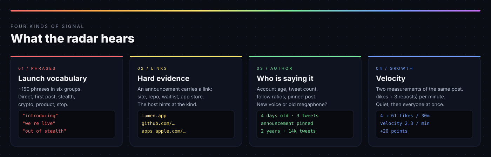
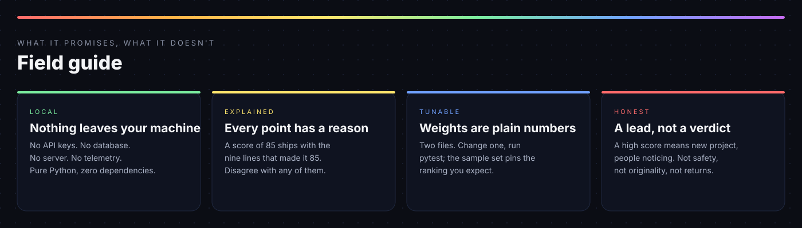
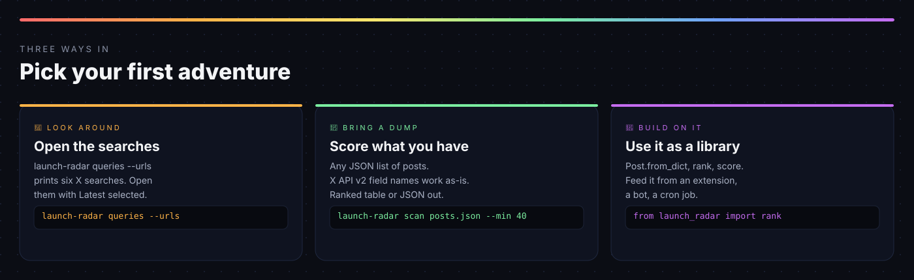
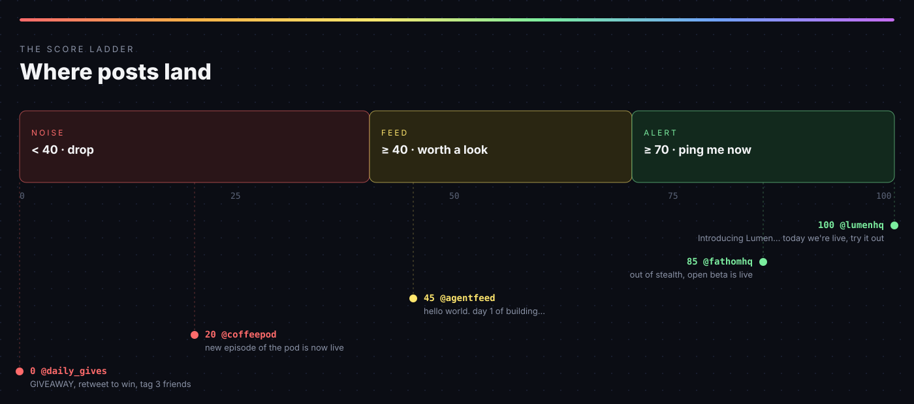
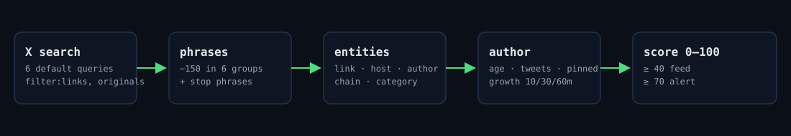
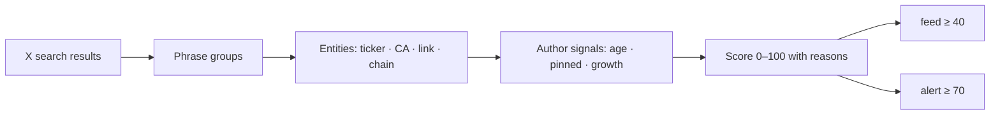

[](docs/img/hero.svg)

[](https://github.com/Renaissancexbt/launch-radar/actions/workflows/tests.yml)


[](LICENSE)
[](https://x.com/renaisancexbt)

# 📡 Meet the early side of your feed.

**Every launch is announced with the same five words as the last one.**
A small radar that finds new products, tools and projects on X before anyone retweets them.

[What it hears](#-what-the-radar-hears) · [Get started](#quick-start) · [Score ladder](#-where-posts-land) · [Architecture](docs/ARCHITECTURE.md) · [Scoring](docs/SCORING.md) · [Roadmap](docs/ROADMAP.md) · [X @renaisancexbt](https://x.com/renaisancexbt)

## 🌈 A radar, with character

Launch posts use a surprisingly stable vocabulary. People have written the same twenty-odd
phrases for a decade: *Introducing…*, *We're live*, *Just launched*, *out of stealth*, *CA:*.
By the time one of them trends, the early part is over. The radar listens for the phrases,
not the trend.

## 🔎 Every point has a reason

A score of 85 ships with the nine lines that made it 85: which phrase fired, which link was
found, how old the account is, how fast the post is moving. Disagree with any of them.

## 🏡 Your computer is home

No API keys, no database, no server, no telemetry. Pure Python, zero dependencies.
The library never makes a network call; fetching is your job and your choice.

## ✨ What the radar hears

[](docs/img/signals.svg)

A launch is most interesting **before it has a crowd**. The radar reads four kinds of signal
out of a post and the account behind it.

## 💬 Phrases

About 150 phrases in six groups. Each group has a weight, each phrase is a compiled regex that
tolerates line breaks and double spaces, and two wildcards stand in for a project name
(`meet [name]`, `[name] is live`) and any cashtag (`$TICKER is live`).

| Group | Weight | Sounds like |
| --- | ---: | --- |
| **Direct announcement** | +30 | introducing · we're live · just launched · launching today · it's finally here · we just shipped · excited to announce · unveiling · sneak peek |
| **Crypto launch** | +20 | fair launch · contract address · mainnet is live · testnet is live · open beta on chain · TGE |
| **First post** | +15 | hello world · gm world · first tweet · we're here · what we're building · day 1 · genesis · chapter 1 · follow for updates |
| **Building / stealth** | +15 | we've been building · been cooking · out of stealth · after months of building · building in public · soft launch · open beta · early access · join the waitlist |
| **Product available** | +15 | app is live · website is live · available now · live on product hunt · download now · try it out · sign up now |
| **Stop phrases** | −25 | introducing myself · launched my podcast · now live on twitch · giveaway · retweet to win · tag 3 friends · drop your wallet · first 100 to |

Stop phrases are the same words with a different meaning. They are forgiven only when the post
also carries hard evidence: a link, a cashtag or a contract address.

## 🔗 Links and evidence

An announcement almost always carries a link: the product site, a GitHub repo, a waitlist,
an app store page. The radar treats a link as hard evidence (+15) and uses the host to guess
what kind of project it is. Cashtags and contract-shaped strings are recognised too, so a
crypto-native launch is not missed, but they are one signal among many and never required.

## 📈 Growth

Give the radar two measurements of the same post, `likes`/`reposts` now and `later`
thirty minutes on, and it scores velocity as `(likes + 3·reposts) per minute`, up to twenty
points. Quiet for a day, then everyone at once: that is the shape it is looking for.

### Try it in one minute

```
pip install -e ".[dev]"
launch-radar scan examples/sample_posts.json
```

```
score  status author             chain    cat     text
----------------------------------------------------------------------------------------------------
  100  alert  @lumenhq           -        app     Introducing Lumen. We've been building for 4 months and t...
   85  alert  @fathomhq          -        -       After a year of building, Fathom is out of stealth. Open ...
   75  alert  @novel_lab         -        -       Our website is live. Novel is an AI patent lab that draft...
   45  feed   @agentfeed         -        ai      hello world. we're here. day 1 of building the social lay...
   20  noise  @coffeepod         -        -       New episode of the pod is now live! We talk about markets...
    0  noise  @jane_doe          -        -       Excited to announce I'm introducing myself to the team at...
    0  noise  @daily_gives       -        -       GIVEAWAY retweet to win a MacBook, tag 3 friends, follow ...

[100] https://x.com/lumenhq/status/1001
      - Direct launch announcement: introducing, we're live (+30)
      - Coming out of stealth, beta, waitlist: we've been building (+15)
      - Product is available: try it out (+15)
      - has link / contract (+15)
      - account 4d old (+15)
      - announcement is pinned (+5)
      - growth 57 likes / 13 reposts in 30m (+20)
```

Seven posts, three of them traps. A podcast that is "now live", a person "introducing myself"
to a new team and a giveaway farming follows all land under 40. The sample handles and
products are invented.

### Same rules everywhere

- **Research-only.** The radar reads text and prints numbers. It never posts, follows or acts on anything.
- **Local.** No request leaves the library. The CLI reads a file you point it at.
- **Bounded.** Scores are clamped to 0–100; a post with no launch phrase at all is capped at 25 no matter what else it carries.
- **Honest.** A score describes a post and an account, not a product. Three coordinated accounts can fake a phrase; a match is a lead, not a verified project.

## Meet your radar

[](docs/img/field-guide.svg)

launch-radar is a Python package with five small modules and a CLI. **keywords** holds the
phrase groups. **entities** pulls links, cashtags, chain and category out of text.
**models** normalises any post shape into `Post`, `Author` and `Candidate`. **scoring** turns a
post into a number with reasons. **queries** writes the X searches that find candidates in the
first place.

This is an open-source developer preview, not a signal service. A high score is a research
lead, not proof of safety, originality or future returns.

## What it does

| Layer | Behavior |
| --- | --- |
| 📡 Phrases | Six weighted groups, ~150 compiled patterns, name and cashtag wildcards, stop-phrase traps forgiven only with hard evidence |
| Entities | Links and their hosts, cashtags minus majors, contract-shaped strings, word-count category guess (app, ai, infra, social, game, defi, nft) |
| Author | Account age bands (< 7 d, < 60 d, > 2 y), tweet count, follow-farm ratios, pinned announcement |
| Growth | Two-measurement velocity, weighted toward reposts, capped at +20 |
| Score | 0–100, every factor appended to a human-readable `reasons` list; `feed` ≥ 40, `alert` ≥ 70 |
| Queries | Six default X searches plus an exhaustive sweep, as strings and as `x.com/search` URLs with *Latest* preselected |
| CLI | `queries`, `scan`, `check`; table or JSON out; works on any JSON list of posts, X API v2 field names included |

**The scorer is deterministic and offline.** The same input always gives the same number, and
you can read why in two files. Nothing here is a model, a firehose or a licensed data service.

## Pick your first adventure

[](docs/img/modes.svg)

- **🔎 Just look around:** `launch-radar queries --urls` prints six X searches; open them with *Latest* selected and read what the radar would read.
- **📂 Bring a dump:** export posts from any tool into a JSON list and run `launch-radar scan`.
- **⚡ Check one post:** `launch-radar check "..."` scores a text you paste.
- **🧩 Build on it:** `from launch_radar import Post, rank` and feed it from an extension, a bot or a cron job.
- **🌱 Teach it a phrase:** add one line to `keywords.py`, one post to the sample set, one assertion. That is a complete pull request.

## Quick start

Python **3.10+**. Nothing else. macOS, Linux, Windows.

```
git clone https://github.com/Renaissancexbt/launch-radar.git
cd launch-radar
pip install -e ".[dev]"
pytest -q
```

1. Print the searches: `launch-radar queries --urls`. Open any of them in X and switch the tab to **Latest**.
2. Collect a few posts into `posts.json` (see [input format](#input-format)) or start with `examples/sample_posts.json`.
3. Rank them: `launch-radar scan posts.json`. Add `--min 40` to see only the feed, `--json` for machine output.
4. Open the top result's URL and read the reasons printed under it.
5. Disagree with a weight? Change it in `launch_radar/scoring.py`, run `pytest`, see what moved.

**Try it without X at all:** `launch-radar check "Introducing Lumen. We've been building for months and today we're live."`
prints a score and its reasons for any text you type.

## Give it the X search operators

The queries lean on five operators. Knowing them lets you write your own.

```
("introducing" OR "we're live" OR "just launched" OR "now live" OR "announcing" OR "launching today")
  filter:links -filter:replies -filter:retweets lang:en min_faves:2
```

| Operator | Why |
| --- | --- |
| `filter:links` | An announcement almost always carries a link: site, CA, launchpad. Cuts about 70% of noise on its own. |
| `-filter:replies -filter:retweets` | Originals only. |
| `min_faves:N` | Engagement floor. Keep it low (1–3) to catch posts early and let the score do the filtering. |
| `since:` / `until:` | Time window. For a live sweep, the last 15 minutes. |
| `lang:en` | Default. Add `zh`, `ko`, `ja` branches if you want them. |

`launch-radar queries --all` chunks every phrase group into eight-phrase queries for a slow,
thorough sweep.

## 📊 Where posts land

[](docs/img/score-ladder.svg)

| Factor | Points | Note |
| --- | ---: | --- |
| Direct announcement phrase | +30 | strongest text signal |
| Crypto launch phrase | +20 | |
| First-post / building / product phrase | +15 | each group once, groups stack |
| Link present | +15 | an announcement without a link is almost useless |
| Cashtag or contract-shaped string | +10 | rarely fires on product launches |
| Link points to a known launch platform | +5 | |
| Account < 7 days / < 60 days | +15 / +10 | |
| Announcement is pinned | +5 | the classic launch move |
| Engagement growth | +0…+20 | (likes + 3·reposts) per minute × 10 |
| Stop phrase without hard evidence | −25 | |
| Bot / spam signals | −30 | ≥ 6 mentions, ≥ 8 hashtags, follow-farm ratios |
| Account > 2 years with > 5000 tweets | −10 | more likely news than a new project |
| Reply or repost | −20 | |
| No launch phrase at all | cap 25 | a link plus a ticker is still just a post |

Stacking is intentional. A four-day-old account that says *introducing*, links the product, pins
the post and doubles its likes in half an hour hits 100, and that is exactly the case the radar
exists to catch within minutes. Full reasoning in [docs/SCORING.md](docs/SCORING.md).

## Follow a discovery

[](docs/img/pipeline.svg)

1. **Listen.** A query returns a post that says *"we've been building… today we're live"*.
2. **Extract.** The text carries a link to the product site and the words "try it out". Category: app.
3. **Verify.** The account is four days old with three tweets, and this is its pinned post.
4. **Measure.** Thirty minutes later the post went from 4 to 61 likes. Velocity counts.
5. **Score.** 100. Status: alert. Nine reasons printed underneath so you can disagree with any of them.

*These illustrations explain the workflow; they are not screenshots or measured results.*

## Your first radar session

- [ ] Install and run `pytest`; 21 green in under a second.
- [ ] Scan the sample set and read the reasons under the top three.
- [ ] Print the queries and open the `direct` one in X on **Latest**.
- [ ] Copy three real posts into a JSON file and scan them.
- [ ] Find one the radar got wrong.
- [ ] Change a weight or add a phrase; run `pytest`; see what moved.
- [ ] Open a pull request with the phrase, the post and one assertion.

## Input format

Any list of objects with at least `id`, `text` and `author.handle`. Everything else is optional
and improves the score.

```json
{
  "id": "1001",
  "text": "Introducing Lumen. We've been building for 4 months and today we're live. https://lumen.app",
  "created_at": "2026-10-07T03:10:00Z",
  "likes": 4, "reposts": 1,
  "later": {"minutes": 30, "likes": 61, "reposts": 14},
  "author": {
    "handle": "lumenhq", "created_at": "2026-10-03T00:00:00Z",
    "followers": 41, "tweets": 3, "bio": "building a calmer inbox",
    "pinned_post_id": "1001"
  }
}
```

X API v2 names (`like_count`, `retweet_count`, `tweet_count`, `impression_count`,
`pinned_tweet_id`, `description`) are accepted as-is, and `created_at` may be ISO 8601, a
Unix timestamp or the old `Wed Oct 07 03:14:00 +0000 2026` form.

## Use it as a library

```python
from launch_radar import Post, rank

posts = [Post.from_dict(d) for d in my_dump]
for c in rank(posts, minimum=40):
    print(c.score, c.status, c.post.url, c.tickers, c.chain, c.category)
    for reason in c.reasons:
        print("   ", reason)
```

`score(post)` returns one `Candidate`; `rank(posts, minimum=...)` sorts them. `extract(text)`
and `match_all(text)` are exposed if you only want the entities or the phrase hits.

## A transparent pipeline



Every arrow is a pure function. There is no state, no cache and no network inside the
library. See [architecture](docs/ARCHITECTURE.md).

## Keep the running cost zero

- **No paid X access needed.** The queries open in the X web search you already have.
- **No model.** Scoring is arithmetic over regex hits; it runs in microseconds.
- **No infrastructure.** A JSON file in, a table out. sqlite arrives with `watch` and stays optional.
- **No key to leak.** There is nothing to put in `.env` because there is no `.env`.

## What's next

- **`launch-radar watch`**: poll the default queries on a timer, append new posts to a local sqlite file.
- **Re-poll** engagement at 10 / 30 / 60 minutes automatically and feed growth into the score.
- **Dedup**: one project = one author + one link/CA.
- **Link liveness** check: does the site resolve, is there a repo behind it.
- **Telegram alerts** for score ≥ 70.
- **Browser extension** that scores posts in the timeline and highlights alerts inline.
- **zh / ko / ja** phrase groups.

Full list in [docs/ROADMAP.md](docs/ROADMAP.md).

## Package, test, contribute

```
pip install -e ".[dev]"
pytest -q
launch-radar scan examples/sample_posts.json --min 40
```

Tests pin the phrase matcher, the entity extractor and the ranking of the sample set. They
run on Python 3.10 and 3.12 in [GitHub Actions](https://github.com/Renaissancexbt/launch-radar/actions)
on every push. They do not establish that every future launch will use these words. See
[CONTRIBUTING.md](CONTRIBUTING.md) and [SECURITY.md](SECURITY.md).

## Project map

```
launch_radar/
  keywords.py        six phrase groups, ~150 compiled patterns, wildcards
  entities.py        link · host · cashtag · chain · category
  models.py          Post, Author, Candidate and the from_dict normaliser
  scoring.py         score(post) → Candidate with reasons; rank(posts)
  queries.py         X advanced-search strings and x.com URLs
  cli.py             queries / scan / check
docs/
  SCORING.md         every weight and why
  ARCHITECTURE.md    modules, pipeline, design rules
  ROADMAP.md         what comes next
  img/               hero, signals, field guide, modes, score ladder, pipeline
examples/            sample_posts.json: seven product launches, three of them traps
tests/               21 tests pinning phrases, entities and the sample ranking
.github/workflows/   pytest on 3.10 and 3.12
```

## Limits worth understanding

Phrases change slower than markup, but they change. A launch written in a language the radar
does not know, or one that avoids every stock phrase, will score low. A contract-shaped string is validated by shape only. Category is a word count, not an understanding.
Growth describes two numbers you supplied, not all of X. Three coordinated accounts can fake a
phrase; a match is a lead, not a verified project. No score here detects every bot ring.

The library is pure and offline. Nothing is stored, nothing is sent. Read
[SECURITY.md](SECURITY.md) before adding anything that changes that.

MIT · Independent project. Not affiliated with X.

🔴 🟠 🟡 🟢 🔵 🟣

**Hear it before it's loud.**
If this little radar belongs in your workflow, give it a star and help it grow.
